# 🎮 UnPdeC

    此项目是Unpde(c#)的替代项项目
    尝试解压.pde游戏文件
    使用 腾讯元宝，Kimi, Claude 辅助开发
    使用新的方法来导出全部文件！
    为了学习编程和加解密算法而研究
    请勿用于任何商业目的！

## 🦋 依赖

    nlohmann.json" version="3.11.2"
    FastXor.exe

## 🔨 Build

    C++标准 -> C++20
    VS2022
    Win64平台

## 🔧 测试程序

[UnPdeC.exe](Release/UnPdeC.exe)
[FastXOR.exe](Release/FastXOR.exe)

## 🚀 使用
    0: Visual C++ RunTime: https://aka.ms/vs/17/release/vc_redist.x64.exe
    1: .pde文件需要和 FastOR.exe与UnPdeC.exe在同一目录下
    2：FastXOR.exe 异或.pde文件
    3：UnPdec.exe 即可解包.xor文件 

------------

## 🐛 辅助工具

### C++

#### [FastXOR](Release/FastXOR.exe)
    快速的将 .pde 文件异或为 .xor 文件
    使其可以被 UnPdeC.exe 使用


#### [UnLuacBAT & UnLuacGVM](Release/UnLuacBAT/)
    UnLuacGVM
        由 AeonLucid 修改的UnLuac源码,使用Oracle GraalVM生成单独的可执行程序
        感谢 AeonLucid (https://github.com/AeonLucid)
        以及 AvatarStarCBT项目
    UnLuacBAT
        用来调用UnLuacGVM的控制台程序,设置打开方式为此程序后，
        双击.luac文件即可得到name_d.lua文件

#### [UnCache](Tools/UnCache/)
    可以单独解压 .cache 文件

#### [EnCache](Tools/EnCache/)
    未完成的压缩工具

#### [VerifyCRC](Tools/VerifyCRC/)
    可以计算出文件中的校验码
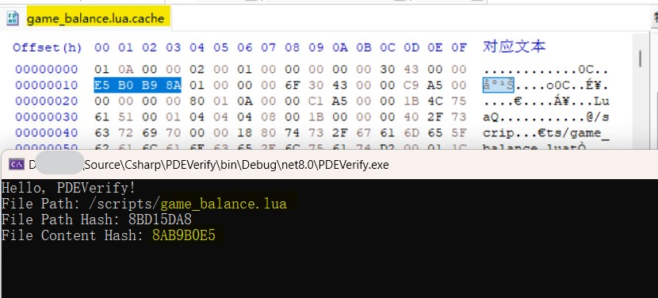

### HTML

#### [FastXOR](Tools/Html_Tools/FastXor.html)
    快速在网页中异或原始字节

#### [PDE偏移值计算器](Tools/Html_Tools/OffsetCalc.html)
    可以将加密的文件或文件夹偏移值转换为实际偏移地址
    也可以将实际的偏移地址转换为回加密的偏移地址

#### [文件偏移模糊计算器](Tools/Html_Tools/XorShiftOffset.html)
    由于异或的大小是0x1000
    那么就可以计算出在某个位置下你需要的值被加密后的值是多少

#### [生成博文中需要的16进制](Tools/Html_Tools/HEXVIEW.html)
    用于生成博文中需要的16进制数据(HxD Style)
    OFFSET    00       04       08       0C        ASCII
    00000000  55736564 20746F20 67656E65 72617465  Used to generate 
    00000010  20746865 20686578 61646563 696D616C   the hexadecimal 
    00000020  20646174 61206E65 65646564 20696E20   data needed in  
    00000030  626C6F67 20706F73 7473               blog posts

#### [IEEE754浮点计算器](Tools/Html_Tools/IEEE754.html)
    用于快速计算.mesh .anim .skel文件中的浮点数

### Blender插件

#### [Blender Mesh Anim Skel 导入插件](Tools/Blender_Plugin/)
    Blender 4.1 , 不完整未完成
    严禁用于商业目的，仅为学习交流！！！

#### [Addon Reloader](https://github.com/0xletleon/AddonReloader)
    快速重新加载Blender插件
    无需进入设置手动禁用在启用
    适合开发调试Blender插件时是用

### C# .NET8 (其他仓库)

#### [PDEVerifyGUI](https://letleon.coding.net/public/3d/PDEVerifyGUI/git/files)
    GUI版本

------------

### 🧩 探索 Mesh文件
#### [.mesh文件分析](https://www.cnblogs.com/letleon/p/18519674)

    经过与AI们亲切友好交流之后发现.mesh文件似乎可以手动重建！
    使用 Blender Mesh 导入插件可以导入部分文件
    当然这也仅仅只是个测试！

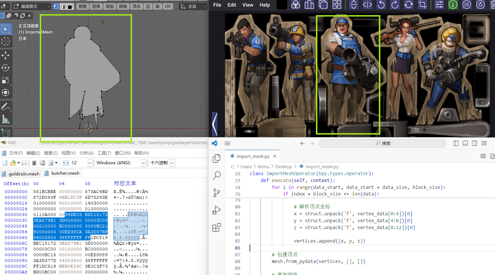

    👆 导入之后只有顶点，没有边和面，上面是暴力F之后自动建立的面
    可以看出这是训练关中胖子木板假人模型

    0X31处的4个字节是模型数据块总大小
        10A00000 -> 模型数据块总大小

    mesh中每0X34为一个顶点的信息(还需要继续探索)
        D4DEC6BD C151723E A579B13D -> 顶点 X Y Z
        00000000 003C0000 210000BC -> 未知
        00000000 00BC2180 00000000 -> 未知
        ED38CA3A 3D37BF34 00380038 -> 未知
        FFFFFFFF -> 结束标记？

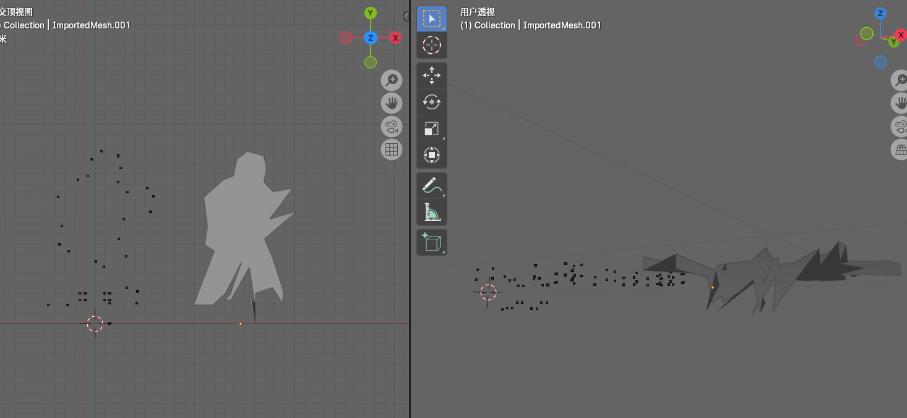

    这是火焰兵？那个喜欢烤肉的男人？🔥

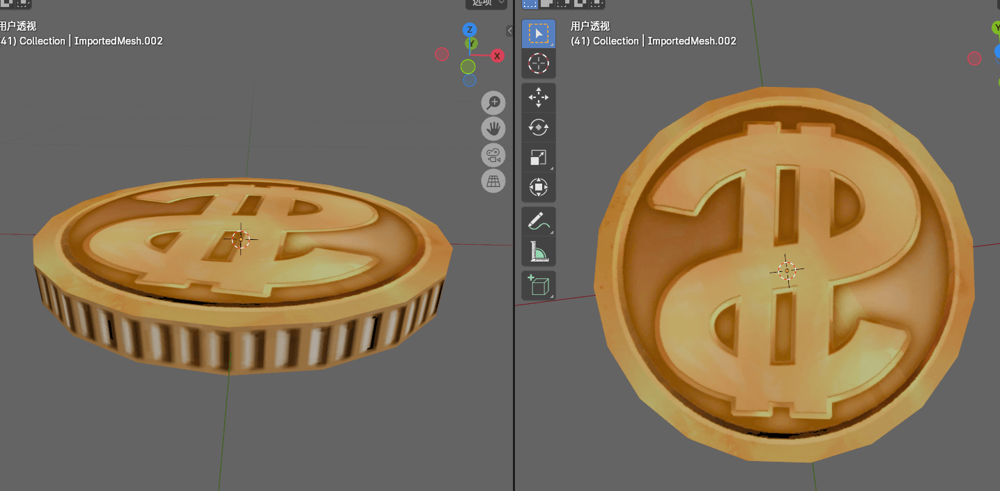

    这是根据顶点信息手动创建边和面，在加上贴图后的金币！
### 🧩 探索 Anim文件
#### [.anim文件分析](https://www.cnblogs.com/letleon/p/18511408)

    尝试导入了火箭兵敲鼓的动画
    看起来有点像，但由于还未找到读取动画的函数
    所以看起来还是怪怪的！

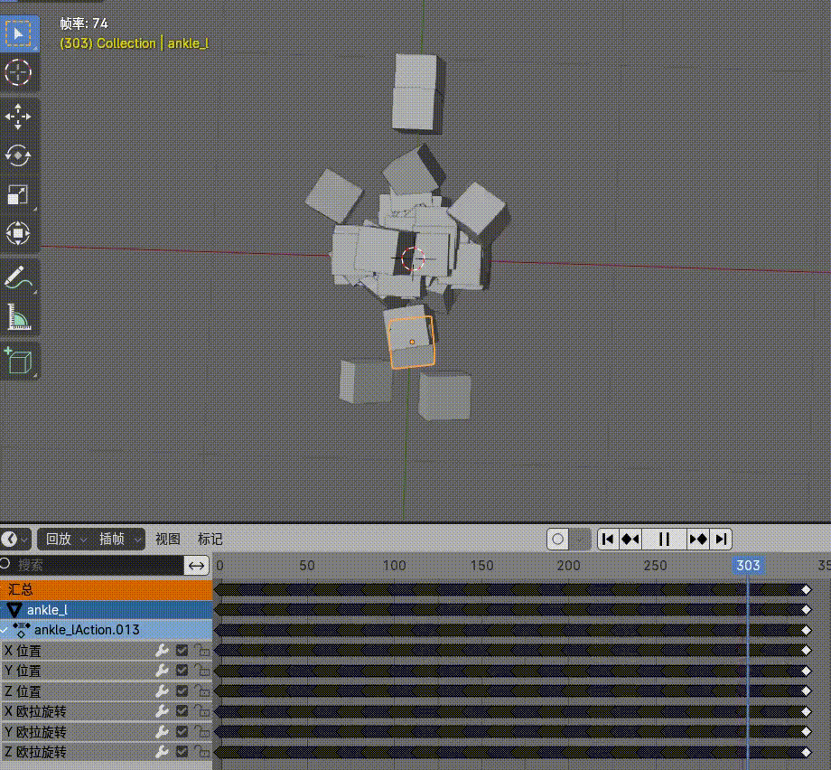
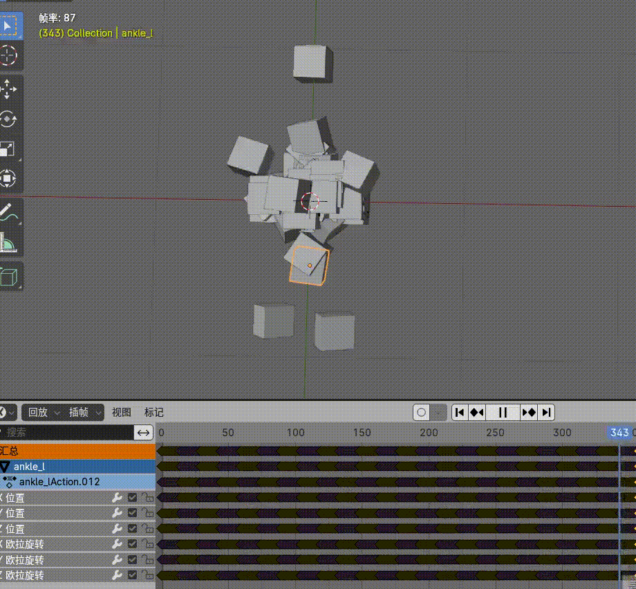

------------

## 🐼🐻🐺🐱 线索

### 根目录

    0X1000 - 0X1FFF
    使用 FastXor.html 即可验证

### 文件信息

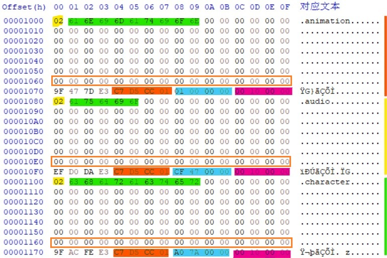

    类型 (黄色)
        01 = 文件 , 02 = 目录

    文件名 (绿色)
        类型之后紧跟的就是文件名

    偏移值 (蓝色)
        相对位置在 0X78-0X7B
        这个偏移值可以使用OffsetCalc.html计算处实际的偏移值
        这个算法很有意思

    大小 (紫色)
        相对位置在 0X7C-0X7F

    文件信息块特征1 (橙色)
        解密后可以观察到每个在目录中的"文件"都有一个标识?
        相对位置在 0X74-0X77 -> C7D5CC01(每个文件中都不一样)

    文件信息块特征2 (橙框)
        0X60 - 0X6F
        这个区域逻辑上是给名称用的
        但是大多数写不到这一行
        所以绝大部分(未验证)是00

### 二次待解密数据分析

    每个后缀为.cache的文件在0x18位置都会有一个标志位
    这个标志位目前观察到的作用是用来判断是否需要参与二次解密
    以及会影响解码后数据大小的位置

#### 6F

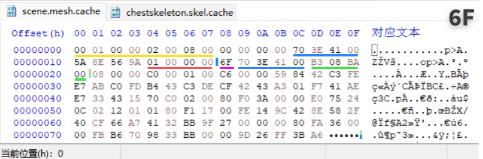

```
紫色 -> 标志: 6F
黄色 -> head: 010A0000 02008100
蓝色1 & 蓝色2 -> 从0X18开始到结尾的大小: 703E4100 -> 0X413E70
红色 -> 文件数量？: 01000000 -> 0X1
绿色 -> 解码后大小: B308BA00 -> 0XBA08B3
实际参与解码的数据:
    从0x21开始(绿色竖线)到结尾
最终文件:
    需要移除前8个字节
```

#### 6D

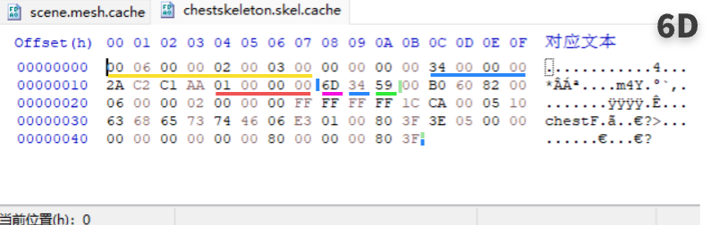

```
紫色 -> 标志: 6D
黄色 -> head: 00060000 02000300
蓝色1 & 蓝色2 -> 从0X18开始到结尾的大小: 340000 -> 0X34
红色 -> 文件数量？: 01000000 -> 0X1
绿色 -> 解码后大小: 59 -> 0X59
实际参与解码的数据:
    从0x1B开始(绿色竖线)到结尾
最终文件:
    需要移除前8个字节 ? 未验证！！！
```

------------

### 奇怪的地方

#### 奇怪的名字

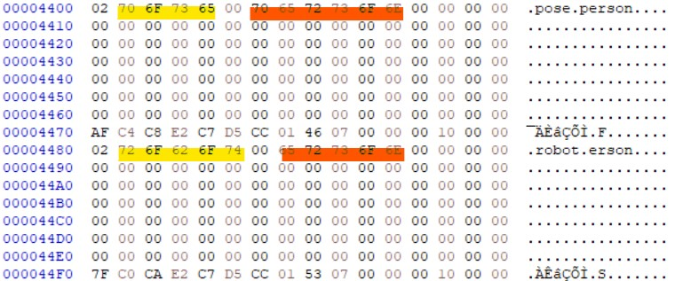

    正常来说文件名后面是00的话文件名就结束了
    有几处会出现00后面还有字符串的情况

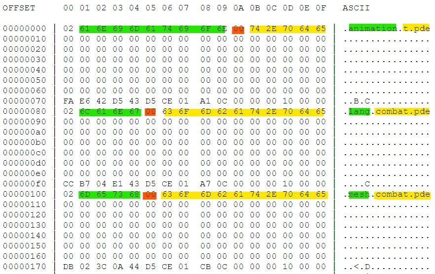

    在某更新补丁内找到了相同的情况
    看样子应该是被复用了
    程序只读到00就结束了
    所以不影响

#### 不匹配的数据大小

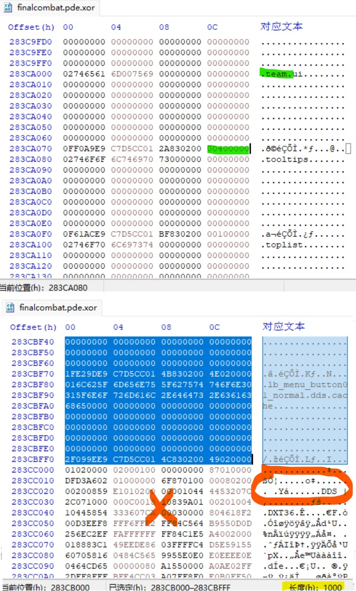

    可以看到 team 文件夹描述中写的是0x4000
    但是实际上却只有 0x100 大小
    再往后的内容是某个DDS文件数据的空间

    也就是说依赖描述中的信息有些不可靠了！
    或者说这些错误的信息是被抛弃的？

------------

## 🖼️🎵 资源预览工具

### DDS/TGA预览工具

[TacentView]([Tools/DDSView.html](https://github.com/bluescan/tacentview))

### FSB音频提取工具

[FSB Extractor](http://aezay.dk/aezay/fsbextractor/)

    有些音乐听起来可能怪怪的，
    可以用音乐转换工具将mp3还转换成mp3格式就可以正常听了。
    比如千千静听,foobar2000都内置转换器！
