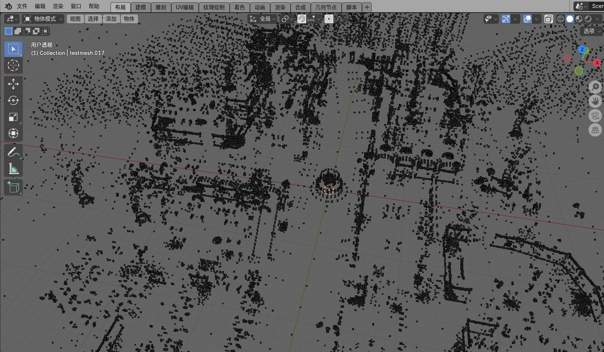
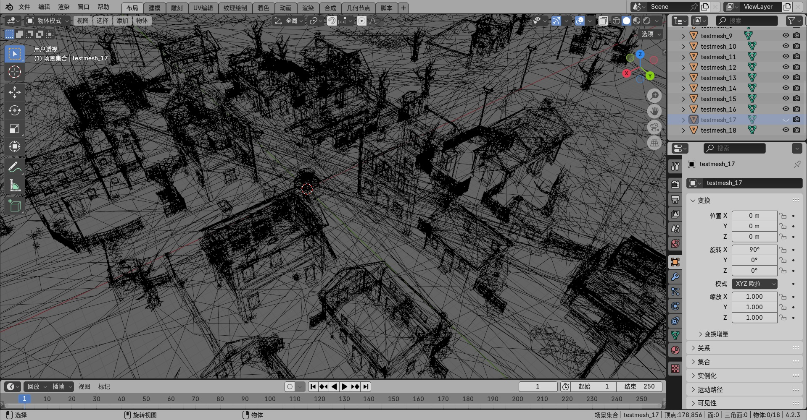

# 导入地图模型插件

## 仅为学习而研究，请勿用于商业用途

    由于原地图文件内容解析起来过于复杂(主要是懒得写)
    所以目前只是将 顶点数据 和 顶点索引提取到一个单独的文件中
    
    可以解析顶点和边的数据，但是边的数据似乎解析有问题，
    会导致Blender无法编辑！

## 文件说明
 - testmesh.mesh 仅包含顶点和顶点索引的自定义mesh文件
 - testmapmesh.blend 是使用插件在Blender 4.2 中导出的文件

