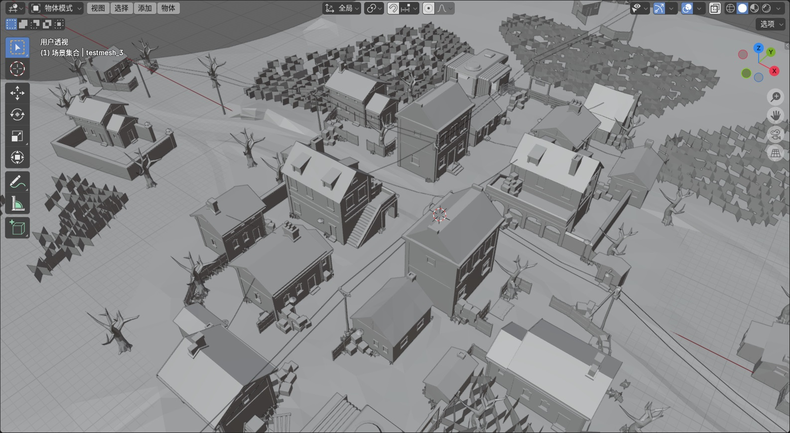

# 导入地图模型插件

## 仅为学习而研究，请勿用于商业用途

    由于原地图文件内容解析起来过于复杂(主要是懒得写)
    所以目前只是将 顶点数据 和 顶点索引提取到一个单独的文件中

## 文件说明
 - testmesh.mesh 仅包含顶点和顶点索引的自定义mesh文件
 - testmapmesh.blend 是使用插件在Blender 4.2 中导出的文件

## Todo
- [√] 创建自定义Mesh,加快测试
- [√] 解析顶点
- [√] 解析顶点索引
- [ ] 解析UV
- [ ] 解析原始Mesh,重新写规则